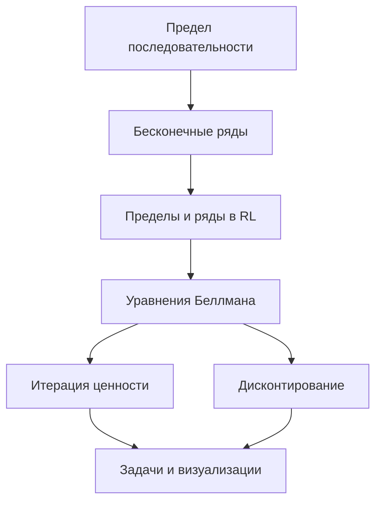

# Введение

## Зачем это нужно

Агент в среде получает награду на каждом шаге. Эпизод может не заканчиваться никогда — тележка балансирует шест, робот удерживает равновесие, торговый агент работает годами. Спросим у такого агента, насколько хорошо ему в текущем состоянии, и он должен ответить числом. Но сумма наград за бесконечное будущее — это сумма бесконечного количества слагаемых, а складывать бесконечно много чисел арифметика не умеет.

Вторая та же трудность приходит с другой стороны. Итерация ценности (value iteration) уточняет оценку состояний шаг за шагом и формально не останавливается никогда. Мы всё равно останавливаем её после сотни проходов и объявляем результат ответом. Почему это законно?

Оба вопроса — про одно и то же: про предел. Предел даёт способ приписать бесконечному процессу конечное число и объяснить, при каких условиях это число существует. Вся эта часть посвящена ровно одному навыку: увидеть за формулой RL бесконечный процесс и уметь сказать, сходится он или нет.

## Обозначения

| Символ | Значение | Роль |
|--------|----------|------|
| $\enfVar{s} \in \mathcal{S}$ | состояние среды | `variable` |
| $\enfFun{a} \in \mathcal{A}$ | действие агента | `function` |
| $\enfTgt{r}_t$ | награда, полученная на шаге $t$ | `target` |
| $\enfPar{\gamma} \in [0, 1)$ | коэффициент дисконтирования | `parameter` |
| $\enfOp{G}_t$ | возврат (return) — суммарная награда с шага $t$ | `operator` |
| $\enfOp{V}(\enfVar{s})$ | ценность состояния | `operator` |
| $\{x_n\}$ | последовательность вещественных чисел | `variable` |

Здесь $\enfVar{s}$ — то, что мы наблюдаем и над чем действуем, поэтому его роль `variable`. $\enfFun{a}$ — действие, то есть преобразование состояния, отсюда роль `function`. $\enfPar{\gamma}$ настраивается человеком до обучения — это `parameter`. Награда $\enfTgt{r}_t$ — то, ради чего всё делается, роль `target`. Наконец $\enfOp{G}_t$ и $\enfOp{V}$ — агрегаты, они сворачивают много наград в одно число, поэтому получают роль `operator`. Эти роли сохраняются за символами во всех разделах пособия.

## Три места, где в RL появляется бесконечность

### Возврат как бесконечная сумма

Возврат с момента $t$ — это то, что агент получит в будущем:

$$
\enfOp{G}_t = \enfTgt{r}_{t+1} + \enfPar{\gamma}\,\enfTgt{r}_{t+2} + \enfPar{\gamma}^2\,\enfTgt{r}_{t+3} + \dots = \sum_{k=0}^{\infty} \enfPar{\gamma}^{k}\,\enfTgt{r}_{t+k+1}.
$$

Слагаемых бесконечно много. Множитель $\enfPar{\gamma}^{k}$ гасит далёкие награды, и именно он — а не что-либо ещё — делает сумму конечной. Разбор этой конструкции — в разделе [3. Пределы и ряды в контексте обучения с подкреплением](03-limits-in-rl.md).

### Итерации динамического программирования

Итерация ценности строит последовательность функций $\enfOp{V}_0, \enfOp{V}_1, \enfOp{V}_2, \dots$, где каждая следующая получается из предыдущей одним и тем же преобразованием. Вопрос «когда можно остановиться» — это вопрос о пределе последовательности. Разбор — в разделе [5. Итерация ценности: сходимость на практике](05-value-iteration.md).

### Оценки по выборке

Ценность состояния оценивают, усредняя возвраты по эпизодам. Среднее по $n$ эпизодам — тоже последовательность, индексированная числом наблюдений, и её сходимость к истинному значению — содержание закона больших чисел. Формальную часть даёт [Часть IV](../part-4-probability/01-probability-theory.md), но язык, на котором это утверждение записывается, вводится здесь.

## Что именно нужно доказать

Во всех трёх случаях вопрос один: существует ли у процесса предел и как быстро он достигается. Практический интерес несут оба ответа.

- **Существование** говорит, что задача поставлена корректно. Если ряд наград расходится, «ценность состояния» — не число, и алгоритм оптимизирует несуществующую величину.
- **Скорость** говорит, сколько итераций стоит запланировать. Для итерации ценности скорость определяется тем же $\enfPar{\gamma}$: чем он ближе к единице, тем медленнее сходимость и тем дороже обучение.

> [!intuition] Почему $\gamma < 1$ появляется так часто
> Условие $\enfPar{\gamma} < 1$ выглядит как техническая оговорка, а на деле это единственное, что удерживает всю конструкцию от развала. Оно одновременно делает возврат конечным, превращает оператор Беллмана в сжимающее отображение и задаёт скорость сходимости итераций. Одна константа отвечает сразу за три свойства — поэтому её выбору посвящён отдельный раздел [6. Дисконтирование в RL и его влияние](06-discounting-in-rl.md).

## Как устроена эта часть

Порядок изложения идёт от чистой математики к её применению, и каждый следующий раздел опирается на предыдущий.

Разделы 1–2 — математика без единого упоминания агентов. Разделы 3–6 переводят её на язык RL. Разделы 7–8b закрепляют навык на задачах.

## Что стоит запомнить

1. Ценность состояния в RL определена как сумма бесконечного ряда, поэтому вопрос о её существовании — вопрос о сходимости ряда.
2. Итеративные алгоритмы RL строят последовательности приближений; остановка на конечном шаге оправдана только сходимостью этой последовательности.
3. Коэффициент $\enfPar{\gamma} < 1$ отвечает одновременно за конечность возврата и за скорость сходимости итераций.
4. Скорость сходимости — не теоретическая тонкость, а прямая оценка вычислительной стоимости обучения.

## Проверка себя

1. Агент получает награду $+1$ на каждом шаге бесконечного эпизода. Чему равен возврат при $\gamma = 0$? При $\gamma = 0{,}9$? При $\gamma = 1$?
2. Почему вопрос «сколько итераций value iteration достаточно» не имеет ответа без указания требуемой точности?
3. Назовите ситуацию в RL, где бесконечная сумма наград сходится даже при $\gamma = 1$.
4. Эпизод в среде всегда завершается не позже чем через 500 шагов. Нужен ли в этом случае дисконт для конечности возврата? А для чего-нибудь ещё?

## Навигация

- Часть: [I · Пределы, последовательности и ряды](index.md)
- → Следующий: [1. Теоретические основы: предел последовательности](01-sequence-limit.md)
- Оглавление: [SUMMARY](../SUMMARY.md) · [Карта](../_meta/mindmap.md)

## См. также (другие части пособия)

- [III · 4. Собственные значения и собственные векторы](../part-3-linear-algebra/04-eigenvalues.md) — общие темы: `convergence`
- [VI · Введение: От интуитивного кодирования к математическому осознанию](../part-6-fundamental-rl/00-introduction.md) — общие темы: `rl-bridge`
- [VI · Глава 10. Мост к практике: Unity ML-Agents](../part-6-fundamental-rl/10-unity-ml-agents-bridge.md) — общие темы: `rl-bridge`
- [VII · 1.1 Основные понятия](../part-7-deep-rl/01-core-concepts.md) — общие темы: `rl-bridge`

## Уроки курса

- [Урок 2.5. Параллельные среды](https://rl-cuber-unity-code.com/courses/2-5) — *предлагаемая связь*

## Практика в этом репозитории

- Обзор лаборатории сред — `README.md`

## Источник на сайте

- [I · Пределы, последовательности и ряды → Введение](https://rl-cuber-unity-code.com/math-rl/module-1#введение)
