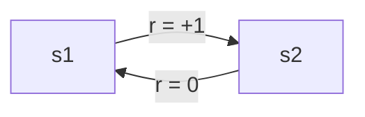

# 4. Уравнения Беллмана и дисконтирование

## Зачем это нужно

Возврат $\enfOp{G}_t$ — величина случайная: одно и то же состояние в разных эпизодах даёт разные суммы наград. Сравнивать состояния по случайной величине нельзя, нужно число. Берут математическое ожидание — так появляется функция ценности.

Дальше происходит главное. Разложение $\enfOp{G}_t = \enfTgt{r}_{t+1} + \enfPar{\gamma}\,\enfOp{G}_{t+1}$, полученное в [предыдущем разделе](03-limits-in-rl.md), переживает взятие ожидания и превращается в уравнение, связывающее ценность состояния с ценностями соседних состояний. Бесконечная сумма исчезает, остаётся система уравнений с конечным числом неизвестных — по числу состояний. Именно этот переход делает RL вычислимым.

## Обозначения

| Символ | Значение | Роль |
|--------|----------|------|
| $\enfVar{s}, \enfVar{s}' \in \mathcal{S}$ | текущее и следующее состояние | `variable` |
| $\enfFun{a} \in \mathcal{A}$ | действие агента | `function` |
| $\enfFun{\pi}(\enfFun{a} \mid \enfVar{s})$ | политика — вероятность выбрать $a$ в $s$ | `function` |
| $P(\enfVar{s}' \mid \enfVar{s}, \enfFun{a})$ | вероятность перехода | `function` |
| $\enfTgt{r}$ | немедленная награда | `target` |
| $\enfPar{\gamma} \in [0,1)$ | коэффициент дисконтирования | `parameter` |
| $\enfOp{V}^{\pi}(\enfVar{s})$ | ценность состояния при политике $\pi$ | `operator` |
| $\enfOp{Q}^{\pi}(\enfVar{s}, \enfFun{a})$ | ценность пары «состояние — действие» | `operator` |
| $\enfOp{V}^{*}, \enfOp{Q}^{*}$ | оптимальные функции ценности | `operator` |

Политика $\enfFun{\pi}$ и функция переходов $P$ получают роль `function`: обе преобразуют состояние в распределение. Функции ценности агрегируют будущее в одно число — роль `operator`.

## Функция ценности состояния

> [!definition] Определение 1. Функция ценности состояния
> **Функцией ценности** (state-value function) состояния $\enfVar{s}$ при политике $\enfFun{\pi}$ называется ожидаемый возврат из этого состояния:
> $$\enfOp{V}^{\pi}(\enfVar{s}) = \mathbb{E}_{\pi}\!\left[\enfOp{G}_t \,\middle|\, S_t = \enfVar{s}\right].$$

Ожидание берётся по всем источникам случайности: по выбору действий политикой и по переходам среды. Ценность зависит от политики — одно и то же состояние хорошо для умелого агента и плохо для случайного.

Парная величина учитывает ещё и первое действие.

> [!definition] Определение 2. Функция ценности действия
> $$\enfOp{Q}^{\pi}(\enfVar{s}, \enfFun{a}) = \mathbb{E}_{\pi}\!\left[\enfOp{G}_t \,\middle|\, S_t = \enfVar{s},\, A_t = \enfFun{a}\right].$$

Различие практическое: зная $\enfOp{V}$, для выбора действия нужна модель среды; зная $\enfOp{Q}$, достаточно взять максимум по действиям. Поэтому безмодельные алгоритмы работают с $\enfOp{Q}$.

## Уравнение Беллмана для политики

> [!theorem] Теорема 3. Уравнение ожиданий Беллмана
> Для любой политики $\enfFun{\pi}$ и любого состояния $\enfVar{s}$
> $$\enfOp{V}^{\pi}(\enfVar{s}) = \sum_{a} \pi(a \mid \enfVar{s}) \sum_{s'} P(s' \mid \enfVar{s}, a)\left[\enfTgt{r}(\enfVar{s},a,s') + \enfPar{\gamma}\,\enfOp{V}^{\pi}(s')\right].$$
>
> Политика $\pi$ и функция переходов $P$ оставлены нейтральными: в этой формуле разбирается устройство свёртки будущего, а не роли распределений.

> [!proof] Доказательство
> **Шаг 1.** По определению 1 и рекурсии возврата, полученной в разделе 3:
> $$\enfOp{V}^{\pi}(\enfVar{s}) = \mathbb{E}_{\pi}\!\left[\enfTgt{r}_{t+1} + \enfPar{\gamma}\,\enfOp{G}_{t+1} \,\middle|\, S_t = \enfVar{s}\right].$$
>
> **Шаг 2.** По линейности математического ожидания разобьём его на два слагаемых. Линейность применима, поскольку оба слагаемых интегрируемы: возврат ограничен величиной $r_{\max}/(1-\gamma)$ по результату [раздела 2](02-infinite-series.md).
> $$\enfOp{V}^{\pi}(\enfVar{s}) = \mathbb{E}_{\pi}\!\left[\enfTgt{r}_{t+1} \mid S_t = \enfVar{s}\right] + \enfPar{\gamma}\,\mathbb{E}_{\pi}\!\left[\enfOp{G}_{t+1} \mid S_t = \enfVar{s}\right].$$
>
> **Шаг 3.** Раскроем оба ожидания по формуле полной вероятности, перебирая действие $a$ (его выбирает политика) и следующее состояние $s'$ (его выбирает среда).
>
> **Шаг 4.** Ко второму слагаемому применим закон полного математического ожидания и марковское свойство: распределение будущего после попадания в $s'$ зависит только от $s'$, поэтому $\mathbb{E}_{\pi}[\enfOp{G}_{t+1} \mid S_{t+1} = s'] = \enfOp{V}^{\pi}(s')$. Собирая вместе, получаем требуемое равенство. $\blacksquare$

> [!intuition] Смысл уравнения
> Ценность состояния равна средней по действиям и переходам сумме «что получу сейчас плюс дисконтированная ценность того, куда попаду». Бесконечное будущее свернулось в один символ $\enfOp{V}^{\pi}(s')$ — за счёт того, что это будущее устроено так же, как настоящее. Марковское свойство здесь не украшение, а несущая конструкция: без него $\enfOp{V}^{\pi}(s')$ зависела бы от всей предыстории и свёртки не вышло бы.

## Уравнение оптимальности

Оптимальная политика — та, что даёт наибольшую ценность в каждом состоянии. Для неё усреднение по действиям заменяется выбором лучшего.

> [!theorem] Теорема 4. Уравнение оптимальности Беллмана
> $$\enfOp{V}^{*}(\enfVar{s}) = \max_{a} \sum_{s'} P(s' \mid \enfVar{s}, a)\left[\enfTgt{r}(\enfVar{s},a,s') + \enfPar{\gamma}\,\enfOp{V}^{*}(s')\right],$$
> $$\enfOp{Q}^{*}(\enfVar{s}, a) = \sum_{s'} P(s' \mid \enfVar{s}, a)\left[\enfTgt{r} + \enfPar{\gamma}\,\max_{a'} \enfOp{Q}^{*}(s', a')\right].$$

Отличие от теоремы 3 — одно: внешняя сумма по действиям с весами $\enfFun{\pi}(a \mid s)$ заменена максимумом. Замена делает уравнение нелинейным, и решить его как линейную систему уже нельзя — отсюда необходимость итерационных методов, которым посвящён [следующий раздел](05-value-iteration.md).

## Пример: MDP с двумя состояниями

Разберём числовой пример полностью. Среда: два состояния $\enfVar{s}_1$ и $\enfVar{s}_2$. В каждом доступно одно действие, переходы детерминированы: из $\enfVar{s}_1$ агент попадает в $\enfVar{s}_2$ и получает награду $+1$; из $\enfVar{s}_2$ возвращается в $\enfVar{s}_1$ и получает $0$. Дисконт $\enfPar{\gamma} = 0{,}9$.

**Шаг 1.** Политика единственна, переходы детерминированы, поэтому обе суммы в теореме 3 вырождаются в одно слагаемое:

$$
\enfOp{V}(\enfVar{s}_1) = 1 + \enfPar{\gamma}\,\enfOp{V}(\enfVar{s}_2), \qquad
\enfOp{V}(\enfVar{s}_2) = 0 + \enfPar{\gamma}\,\enfOp{V}(\enfVar{s}_1).
$$

**Шаг 2.** Подставим второе уравнение в первое:

$$
\enfOp{V}(\enfVar{s}_1) = 1 + \enfPar{\gamma}\cdot\enfPar{\gamma}\,\enfOp{V}(\enfVar{s}_1) = 1 + \enfPar{\gamma}^2\,\enfOp{V}(\enfVar{s}_1).
$$

**Шаг 3.** Соберём слагаемые с неизвестной слева и разделим на $(1-\enfPar{\gamma}^2)$. Деление законно: при $\enfPar{\gamma} = 0{,}9$ имеем $1 - 0{,}81 = 0{,}19 \neq 0$.

$$
\enfOp{V}(\enfVar{s}_1) = \frac{1}{1 - \enfPar{\gamma}^2} = \frac{1}{0{,}19} \approx 5{,}263.
$$

**Шаг 4.** Обратной подстановкой $\enfOp{V}(\enfVar{s}_2) = 0{,}9 \cdot 5{,}263 \approx 4{,}737$.

**Проверка.** Из $\enfVar{s}_1$ агент получает награды $1, 0, 1, 0, \dots$ на шагах $0, 1, 2, \dots$, то есть ряд $\sum_{k=0}^{\infty} \enfPar{\gamma}^{2k} = 1/(1-\enfPar{\gamma}^2)$ по формуле геометрического ряда со знаменателем $\gamma^2$. Совпадает. $\blacksquare$

Оценка сверху из [раздела 2](02-infinite-series.md) даёт $r_{\max}/(1-\gamma) = 1/0{,}1 = 10$; найденные значения 5,26 и 4,74 в неё укладываются, как и должны.

## Что стоит запомнить

1. Функция ценности — математическое ожидание возврата; она превращает случайную величину в число, по которому состояния можно сравнивать.
2. Уравнение Беллмана получается взятием ожидания от рекурсии возврата и опирается на марковское свойство: без него свёртка будущего в один символ невозможна.
3. Для фиксированной политики уравнение линейно — это система из $|\mathcal{S}|$ уравнений с $|\mathcal{S}|$ неизвестными.
4. Уравнение оптимальности заменяет усреднение по действиям максимумом и становится нелинейным; отсюда необходимость итерационных методов.
5. Работая с $Q$, действие выбирают без модели среды; работая с $V$, модель нужна — этим и определяется выбор между семействами алгоритмов.

## Проверка себя

1. Пересчитайте пример при $\gamma = 0{,}5$. Во сколько раз уменьшилась ценность $s_1$?
2. Добавьте в $s_1$ второе действие: остаться на месте с наградой $+0{,}4$. Какое действие оптимально при $\gamma = 0{,}9$? А при $\gamma = 0{,}1$?
3. Выразите $V^{\pi}(s)$ через $Q^{\pi}(s,a)$ и наоборот. Какая из двух формул требует знания модели среды?
4. Почему уравнение оптимальности нельзя решить методом Гаусса, а уравнение для фиксированной политики — можно?
5. В среде 25 состояний и 4 действия. Сколько неизвестных в системе для $V^{\pi}$ и сколько — для $Q^{\pi}$?

## Навигация

- Часть: [I · Пределы, последовательности и ряды](index.md)
- ← Предыдущий: [3. Пределы и ряды в контексте обучения с подкреплением](03-limits-in-rl.md)
- → Следующий: [5. Итерация ценности: сходимость на практике](05-value-iteration.md)
- Оглавление: [SUMMARY](../SUMMARY.md) · [Карта](../_meta/mindmap.md)

## См. также (другие части пособия)

- [IV · 4. Функции ценности и уравнения Беллмана](../part-4-probability/04-value-functions-bellman.md) — общие темы: `bellman`, `mdp`, `value-function`
- [VI · Глава 4. Возврат, политики и функции ценности](../part-6-fundamental-rl/04-return-policy-value.md) — общие темы: `discounting`, `value-function`
- [VI · Глава 5. Сердце RL: Уравнения Беллмана](../part-6-fundamental-rl/05-bellman-equations.md) — общие темы: `bellman`, `value-function`
- [IV · 3. Марковские процессы](../part-4-probability/03-markov-processes.md) — общие темы: `mdp`
- [VI · Глава 3. Марковские процессы принятия решений (MDP)](../part-6-fundamental-rl/03-mdp.md) — общие темы: `mdp`

## Уроки курса

- **[Урок 1.1. Что такое обучение с подкреплением?](https://rl-cuber-unity-code.com/courses/1-1)** — Математика за γ и бесконечными суммами наград ⟵ *связь уже есть на сайте*
- [Урок 1.3. Марковские процессы принятия решений (MDP)](https://rl-cuber-unity-code.com/courses/1-3) — *предлагаемая связь*
- [Урок 1.4. Q-Learning: табличный метод](https://rl-cuber-unity-code.com/courses/1-4) — *предлагаемая связь*
- [Урок 1.6. DQN с нуля на PyTorch](https://rl-cuber-unity-code.com/courses/1-6) — *предлагаемая связь*
- [Урок 2.4. Reward Shaping](https://rl-cuber-unity-code.com/courses/2-4) — *предлагаемая связь*

## Практика в этом репозитории

- GridWorld: индекс состояния 0–24 для табличного Q — `unity/MLAgentsLab/Assets/Envs/E01_GridWorld/Scripts/GridWorldAgent.cs`
- GridWorld: разметка наград по клеткам — `unity/MLAgentsLab/Assets/Envs/E01_GridWorld/Scripts/GridWorldEnvironment.cs`
- Оператор Беллмана в коде: одна итерация на 25 состояниях — `python/labrl/algos/tabular/value_iteration.py`
- gamma: 0.99 — горизонт дисконтирования GridWorld — `configs/E01_GridWorld__qlearning.yaml`

## Источник на сайте

- [I · Пределы, последовательности и ряды → 4. Уравнения Беллмана и дисконтирование](https://rl-cuber-unity-code.com/math-rl/module-1#4-уравнения-беллмана-и-дисконтирование)
