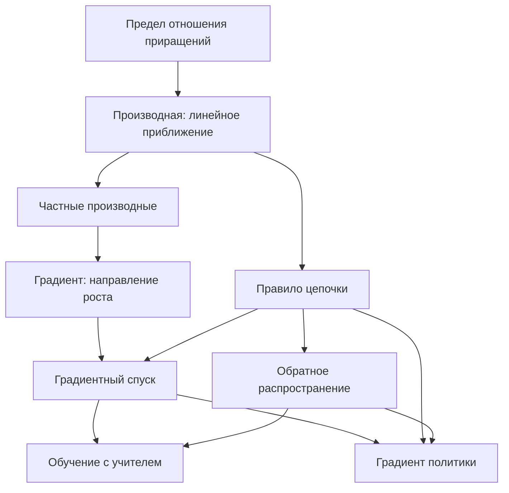

# § 5. Весь раздел в одной картине

## Зачем это нужно

Четыре предыдущих раздела двигались по прямой: производная, градиент, спуск, применение в RL. Такая последовательность хороша при первом чтении и плоха при возвращении — из неё не видно, какие связи между понятиями несущие, а какие второстепенные.

Этот раздел собирает пройденное в одну схему и показывает, что все методы обучения в пособии — варианты одного правила, отличающиеся тем, чем именно взвешивается градиент. Раздел не вводит новых понятий; он нужен, чтобы перед переходом к [линейной алгебре](../part-3-linear-algebra/index.md) убедиться, что каркас держится.

## Обозначения

| Символ | Значение | Роль |
|--------|----------|------|
| $\enfPar{\theta}$ | параметры модели или политики | `parameter` |
| $\enfPar{\alpha}$ | скорость обучения | `parameter` |
| $\enfTgt{\mathcal{L}}, \enfTgt{J}$ | минимизируемые потери и максимизируемая цель | `target` |
| $\enfTgt{\delta}$ | TD-ошибка | `target` |
| $\enfOp{\nabla}$ | градиент по параметрам | `operator` |
| $\enfOp{V}, \enfOp{Q}, \enfOp{A}$ | ценность состояния, действия, преимущество | `operator` |

## Одна цепочка от определения до обучения агента

Ключевых переходов в схеме три, и каждый стоит уметь воспроизвести.

**Переход 1: от предела к линейному приближению.** Производная существует тогда, когда функция вблизи точки ведёт себя как линейная. Всё дальнейшее — эксплуатация этой линейности, поэтому её локальность объясняет и необходимость малого шага, и провал спуска на изломах.

**Переход 2: от одной переменной ко многим.** Частные производные собираются в градиент, и представление скалярного произведения через косинус угла даёт свойство наискорейшего роста. Именно это свойство, а не сама по себе векторная запись, превращает набор чисел в направление движения.

**Переход 3: от известной функции к ожиданию.** В RL цель задана ожиданием по распределению, зависящему от параметров. Тождество $\enfOp{\nabla}p = p\,\enfOp{\nabla}\ln p$ возвращает задачу в область, где работает предыдущий переход.

## Все правила обучения в одной таблице

Наблюдение, ради которого написан раздел: правила обновления параметров во всех рассмотренных методах имеют вид

$$
\enfPar{\theta} \leftarrow \enfPar{\theta} + \enfPar{\alpha}\ \cdot\ (\text{вес}) \ \cdot\ (\text{градиент чего-то по } \enfPar{\theta}).
$$

Различаются методы только тем, что стоит в двух скобках.

*Таблица 1. Единая форма правил обновления.*

| Метод | Вес | Градиент | Раздел |
|---|---|---|---|
| Линейная регрессия | ошибка $(\hat y - y)$ | $\enfOp{\nabla}$ предсказания | [§ 1](01-derivatives.md) |
| Обучение с учителем, кросс-энтропия | $1$ | $\enfOp{\nabla}\ln$ вероятности верного класса | [§ 1](01-derivatives.md) |
| REINFORCE | возврат $\enfOp{G}_t$ | $\enfOp{\nabla}\ln$ вероятности действия | [§ 4](04-policy-gradient-application.md) |
| Актор-критик | преимущество $\enfOp{A}_t$ | $\enfOp{\nabla}\ln$ вероятности действия | [Часть VI](../part-6-fundamental-rl/09-policy-gradients.md) |
| TD-обучение ценности | TD-ошибка $\enfTgt{\delta}_t$ | $\enfOp{\nabla}\enfOp{V}$ | [§ 4](04-policy-gradient-application.md) |
| Q-обучение | TD-ошибка $\enfTgt{\delta}_t$ | $\enfOp{\nabla}\enfOp{Q}$ | [Часть VI](../part-6-fundamental-rl/06-model-free-rl.md) |

Читать таблицу стоит по столбцу «Вес». Он показывает, чем метод считает «хорошо»: обучение с учителем получает ответ извне, REINFORCE берёт весь возврат, актор-критик — только неожиданную его часть, TD-методы — расхождение с собственным прогнозом. Переход от строки к строке снижает дисперсию оценки ценой введения дополнительных приближений.

## Что откуда берётся: обратная сборка

Полезное упражнение — восстановить каждый результат из минимума предпосылок.

- **Почему шаг делается против градиента?** Из теоремы о производной по направлению: скорость изменения равна $\lVert\enfOp{\nabla}\enfTgt{\mathcal{L}}\rVert\cos\varphi$, минимум при $\varphi = 180°$.
- **Почему шаг должен быть малым?** Линейное приближение верно локально; величина допустимого шага определяется кривизной, то есть наибольшим собственным значением матрицы Гессе.
- **Почему обучение зигзагует?** Из-за разброса собственных значений: шаг выбирается по самому крутому направлению, а сходимость определяется самым пологим.
- **Почему в RL появился логарифм?** Из тождества логарифмической производной, единственного способа превратить градиент вероятности в ожидание.
- **Почему из ценности вычитают базис?** Из линейности математического ожидания: вычитание функции состояния даёт нулевой вклад в ожидание, но уменьшает разброс.
- **Почему обновление ценности неустойчиво?** Потому что это полуградиент: производная цели отброшена, и минимизируемой функции не существует.

## Проверка каркаса

Если ответы на следующие вопросы находятся без обращения к предыдущим разделам, каркас держится.

1. Какое свойство функции гарантирует, что малый шаг против градиента уменьшит её значение?
2. Что общего между обратным распространением и вычислением производной сложной функции по правилу цепочки?
3. В чём формальное различие между градиентом и полуградиентом и какое практическое последствие оно имеет?
4. Почему нельзя просто продифференцировать ожидаемый возврат по параметрам политики?
5. Какая величина в правиле обновления отвечает за смещение оценки, а какая — за дисперсию?

## Что дальше

Часть II оставила два долга, и оба закрывает линейная алгебра.

- **Кривизна и обусловленность.** Всюду, где речь шла о собственных значениях матрицы Гессе, предполагалось, что читатель знает, что это такое. [Часть III](../part-3-linear-algebra/04-eigenvalues.md) вводит понятие и объясняет, почему число обусловленности предсказывает скорость обучения.
- **Векторная запись.** Градиент, скалярное произведение и норма использовались как готовые инструменты. [Разделы 1–3 Части III](../part-3-linear-algebra/01-vectors.md) дают их определения и свойства.

После этого [Часть V](../part-5-policy-optimization/index.md) возвращается к градиенту политики и доводит вывод до формул PPO, а [Часть VI](../part-6-fundamental-rl/index.md) собирает алгоритмическую картину целиком.

## Что стоит запомнить

1. Вся часть держится на одном факте: дифференцируемая функция вблизи точки линейна, и производная — коэффициент этой линейности.
2. Свойство наискорейшего роста градиента — следствие представления скалярного произведения через косинус, а не отдельное определение.
3. Все рассмотренные правила обучения имеют вид «параметры плюс скорость обучения, умноженная на вес и на градиент»; методы различаются только весом.
4. Выбор веса — это выбор компромисса между смещением и дисперсией оценки.
5. Логарифм в формулах RL появляется по единственной причине — чтобы превратить градиент вероятности в математическое ожидание.

## Навигация

- Часть: [II · Производные, градиент и оптимизация](index.md)
- ← Предыдущий: [§ 4. Применение в RL: Policy Gradient](04-policy-gradient-application.md)
- Оглавление: [SUMMARY](../SUMMARY.md) · [Карта](../_meta/mindmap.md)

## См. также (другие части пособия)

- [VI · Заключение](../part-6-fundamental-rl/11-conclusion.md) — общие темы: `summary`
- [VII · 2.1 Математический анализ](../part-7-deep-rl/03-calculus.md) — общие темы: `gradient`

## Уроки курса

- [Урок 2.1. Policy Gradient и теорема градиента](https://rl-cuber-unity-code.com/courses/2-1) — *предлагаемая связь*

## Практика в этом репозитории

- _(прямой привязки к средам нет)_

## Источник на сайте

- [II · Производные, градиент и оптимизация → § 5. Весь раздел в одной картине](https://rl-cuber-unity-code.com/math-rl/calculus#5-весь-раздел-в-одной-картине)
