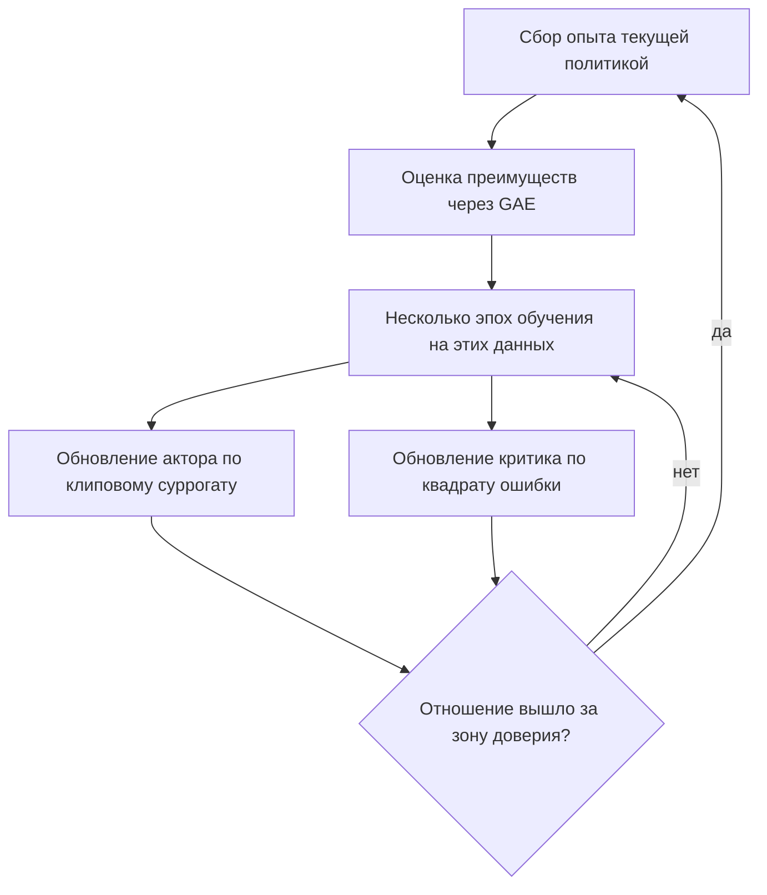

# Лекция 4. Proximal Policy Optimization (PPO)

## Зачем это нужно

Формула градиента политики из [лекции 2](02-policy-gradient-derivation.md) справедлива только для текущей политики. Сделав один шаг обновления, мы получаем новую политику, и весь собранный опыт формально становится непригодным. Собирать эпизоды ради единственного шага градиента — расточительство: сбор данных в RL стоит на порядки дороже самого шага.

PPO решает эту задачу. Он позволяет сделать по одной порции данных несколько шагов обновления, удерживая новую политику вблизи старой — там, где данные ещё пригодны. Устройство метода — прямое следствие вывода предыдущих лекций, и каждый гиперпараметр конфигурации ML-Agents соответствует конкретному члену формулы.

## Обозначения

| Символ | Значение | Роль |
|--------|----------|------|
| $\enfVar{s}, a$ | состояние и действие | `variable`, — |
| $\enfPar{\theta}, \enfPar{\theta}_{\text{old}}$ | новые и старые параметры политики | `parameter` |
| $\enfVar{\rho}_t(\enfPar{\theta})$ | отношение вероятностей действия | `variable` |
| $\enfPar{\varepsilon}$ | ширина зоны доверия (клипа) | `parameter` |
| $\enfPar{\gamma}, \enfPar{\lambda}$ | дисконт и параметр GAE | `parameter` |
| $\enfPar{c}_1, \enfPar{c}_2$ | веса слагаемых целевой функции | `parameter` |
| $\enfTgt{L}$ | максимизируемая целевая функция | `target` |
| $\enfOp{A}_t$ | оценка преимущества | `operator` |
| $\enfOp{V}$ | функция ценности (критик) | `operator` |
| $\enfOp{H}$ | энтропия политики | `operator` |

## Переход к отношению вероятностей

Чтобы использовать данные, собранные старой политикой, применяют **выборку по значимости** (importance sampling): ожидание по одному распределению переписывают как ожидание по другому с поправочным весом.

$$
\mathbb{E}_{a \sim \pi_{\theta}}\!\left[f(a)\right] = \mathbb{E}_{a \sim \pi_{\theta_{\text{old}}}}\!\left[\frac{\pi_{\theta}(a\mid \enfVar{s})}{\pi_{\theta_{\text{old}}}(a\mid \enfVar{s})}\,f(a)\right].
$$

Равенство проверяется раскрытием обеих сторон как сумм по действиям: слева $\sum_a \pi_{\theta}(a)f(a)$, справа $\sum_a \pi_{\theta_{\text{old}}}(a)\frac{\pi_{\theta}(a)}{\pi_{\theta_{\text{old}}}(a)}f(a)$ — после сокращения выражения совпадают. Сокращение законно при $\pi_{\theta_{\text{old}}}(a) > 0$, что softmax и нормальное распределение гарантируют.

Обозначим отношение

$$
\enfVar{\rho}_t(\enfPar{\theta}) = \frac{\pi_{\theta}(a_t\mid \enfVar{s}_t)}{\pi_{\theta_{\text{old}}}(a_t\mid \enfVar{s}_t)}.
$$

Тогда суррогатная целевая функция принимает вид $\enfTgt{L}^{\mathrm{CPI}} = \mathbb{E}\!\left[\enfVar{\rho}_t(\enfPar{\theta})\,\enfOp{A}_t\right]$. При $\enfPar{\theta} = \enfPar{\theta}_{\text{old}}$ отношение равно единице, и градиент этой функции совпадает с обычным градиентом политики — то есть конструкция согласована с выводом [лекции 2](02-policy-gradient-derivation.md).

> [!warning] Почему её нельзя максимизировать напрямую
> Приближение верно лишь вблизи старой политики. Если $\enfOp{A}_t > 0$, максимизация толкает $\enfVar{\rho}_t$ к бесконечности — политика делает выбранное действие почти достоверным на основании одной удачной выборки. Оценка преимущества при этом остаётся старой и уже неверна для изменившейся политики. Результат — катастрофическое падение качества, которое в RL необратимо: испорченная политика собирает плохие данные, и обучение уже не восстанавливается.

## Клиповая целевая функция

Идея PPO предельно прагматична: не позволять отношению уходить далеко, обрезая его.

> [!definition] Определение 1. Клиповый суррогат
> $$\enfTgt{L}^{\mathrm{CLIP}}(\enfPar{\theta}) = \mathbb{E}_t\!\left[\min\Bigl(\enfVar{\rho}_t(\enfPar{\theta})\,\enfOp{A}_t,\ \ \mathrm{clip}\bigl(\enfVar{\rho}_t(\enfPar{\theta}),\ 1-\enfPar{\varepsilon},\ 1+\enfPar{\varepsilon}\bigr)\,\enfOp{A}_t\Bigr)\right],$$
> где $\mathrm{clip}$ ограничивает аргумент отрезком $[1-\enfPar{\varepsilon},\ 1+\enfPar{\varepsilon}]$.

> [!intuition] Как читать минимум
> Разберём два случая по знаку преимущества.
>
> **Преимущество положительно** ($\enfOp{A}_t > 0$): действие лучше среднего, хочется повысить его вероятность. Первый аргумент растёт с $\enfVar{\rho}_t$ неограниченно, второй перестаёт расти при $\enfVar{\rho}_t > 1+\enfPar{\varepsilon}$. Минимум выбирает второй, и стимул увеличивать вероятность исчезает за границей.
>
> **Преимущество отрицательно** ($\enfOp{A}_t < 0$): хочется понизить вероятность. Оба произведения отрицательны; обрезка снизу при $\enfVar{\rho}_t < 1-\enfPar{\varepsilon}$ делает второй аргумент **больше** первого, и минимум выбирает первый — то есть штраф продолжает действовать.
>
> Асимметрия намеренна. Улучшать политику разрешено лишь в пределах зоны доверия, а вот исправлять явно плохое действие разрешено без ограничения — уход в эту сторону не опасен.

Минимум делает целевую функцию нижней оценкой исходной: PPO максимизирует пессимистичную границу, поэтому шаг никогда не переоценивает ожидаемое улучшение.

## Полная целевая функция

На практике максимизируют сумму трёх слагаемых:

$$
\enfTgt{L}(\enfPar{\theta}) = \mathbb{E}_t\!\left[\enfTgt{L}^{\mathrm{CLIP}}_t - \enfPar{c}_1\bigl(\enfOp{V}(\enfVar{s}_t) - \enfOp{V}^{\text{цель}}_t\bigr)^{2} + \enfPar{c}_2\,\enfOp{H}\bigl(\pi_{\theta}(\cdot \mid \enfVar{s}_t)\bigr)\right].
$$

*Таблица 1. Три слагаемых и их назначение.*

| Слагаемое | Что делает | Что будет без него |
|---|---|---|
| Клиповый суррогат | улучшает политику в зоне доверия | обучения политики нет |
| Квадрат ошибки критика | обучает $\enfOp{V}$, нужную для оценки преимущества | преимущество не оценить, дисперсия взлетает |
| Энтропийный член | поощряет разброс политики | преждевременное схлопывание, исследование прекращается |

Энтропия $\enfOp{H}$ максимальна у равномерного распределения и падает по мере того, как политика становится уверенной. Прибавляя её со знаком плюс, мы штрафуем чрезмерную уверенность — это прямое лекарство от насыщения, отмеченного в [лекции 1](01-policy-optimization-basics.md).

## Схема алгоритма

Ключевой момент — блок «несколько эпох». Именно ради него всё и строилось: одна порция данных используется многократно, и стоимость сбора опыта окупается.

## Гиперпараметры

*Таблица 2. Параметры PPO в конфигурации Unity ML-Agents.*

| Параметр | Типичное значение | Смысл | Симптом плохой настройки |
|---|---|---|---|
| `epsilon` | 0,1–0,3 | ширина зоны доверия $\enfPar{\varepsilon}$ | велико — обвалы качества; мало — обучение стоит |
| `learning_rate` | $3\cdot 10^{-4}$ | шаг оптимизатора | велико — нестабильность; мало — медленно |
| `gamma` | 0,95–0,999 | горизонт планирования | мало — близорукость; велико — медленная сходимость |
| `lambd` | 0,95 | компромисс смещения и дисперсии в GAE | 1 — шум; 0 — смещение от неточного критика |
| `num_epoch` | 3 | сколько раз переиспользуются данные | много — уход за зону доверия; мало — расточительность |
| `batch_size` | 1024–4096 | размер мини-батча | мало — шумные шаги |
| `buffer_size` | кратно `batch_size` | объём опыта перед обновлением | мало — смещённая оценка преимуществ |
| `beta` | $10^{-3}$–$10^{-2}$ | вес энтропии $\enfPar{c}_2$ | мало — схлопывание; велико — агент не сходится |

Три замечания о взаимосвязях, которые чаще всего упускают.

- **`gamma` и `learning_rate` настраиваются вместе.** Рост $\gamma$ увеличивает масштаб функции ценности как $1/(1-\gamma)$, а с ним и градиенты критика — обоснование в [Части I](../part-1-limits-series/06-discounting-in-rl.md).
- **`num_epoch` и `epsilon` связаны.** Чем больше эпох, тем дальше уходит политика за проход, и тем важнее узкая зона доверия. Увеличивать оба параметра одновременно — верный способ обрушить обучение.
- **`beta` зависит от размерности действий.** Энтропия непрерывной политики растёт с числом измерений, поэтому одно и то же значение `beta` по-разному влияет на задачу с двумя и с двадцатью действиями.

## Диагностика по логам

*Таблица 3. Что смотреть в TensorBoard и как читать.*

| Наблюдение | Вероятная причина | Действие |
|---|---|---|
| Награда растёт, затем резко падает | шаг за зону доверия | уменьшить `epsilon`, `learning_rate` или `num_epoch` |
| Энтропия быстро падает до нуля | преждевременное схлопывание | увеличить `beta` |
| Энтропия не падает вовсе | `beta` слишком велика | уменьшить `beta` |
| Потери критика не убывают | цель нестационарна или сеть мала | увеличить сеть, проверить масштаб наград |
| Награда стоит с самого начала | сигнал не доходит до начальных состояний | проверить `gamma` против длины эпизода |

Скрипт запуска TensorBoard описан в `docs/TRAINING.md` репозитория сред; метрики энтропии и потерь критика выводятся стандартным тренером ML-Agents.

## Что стоит запомнить

1. PPO позволяет переиспользовать данные, переписывая ожидание через отношение вероятностей — приём выборки по значимости.
2. Приближение верно лишь вблизи старой политики, поэтому отношение обрезают; без обрезки одна удачная выборка способна необратимо испортить политику.
3. Минимум в клиповой формуле делает целевую функцию пессимистичной оценкой и работает несимметрично: рост вероятности ограничен, снижение — нет.
4. Полная целевая функция состоит из трёх слагаемых, и каждое отвечает за свою болезнь: обучение политики, обучение критика, сохранение исследования.
5. Гиперпараметры связаны попарно: `gamma` со скоростью обучения, `num_epoch` с `epsilon`, `beta` с размерностью действий; настраивать их поодиночке бесполезно.

## Проверка себя

1. Проверьте тождество выборки по значимости, расписав обе стороны как суммы по действиям. Где используется положительность старой политики?
2. Пусть $\varepsilon = 0{,}2$, $A_t = +3$, $\rho_t = 1{,}5$. Чему равен клиповый суррогат и каков градиент по $\theta$?
3. Тот же вопрос при $A_t = -3$ и $\rho_t = 0{,}5$. Почему ответы качественно различаются?
4. Почему энтропийный член входит со знаком плюс, если остальная функция максимизируется?
5. В логах: награда растёт 500 тысяч шагов, затем обваливается и не восстанавливается. Назовите три параметра-кандидата и порядок их проверки.

## Навигация

- Часть: [V · Методы оптимизации политик](index.md)
- ← Предыдущий: [Лекция 3. Градиентный спуск и его варианты](03-gradient-descent-variants.md)
- Оглавление: [SUMMARY](../SUMMARY.md) · [Карта](../_meta/mindmap.md)

## См. также (другие части пособия)

- [VI · Глава 10. Мост к практике: Unity ML-Agents](../part-6-fundamental-rl/10-unity-ml-agents-bridge.md) — общие темы: `hyperparameters`

## Уроки курса

- [Урок 2.2. PPO — реализация с нуля](https://rl-cuber-unity-code.com/courses/2-2) — *предлагаемая связь*
- [Проект 3. Гоночный агент](https://rl-cuber-unity-code.com/courses/project-3) — *предлагаемая связь*
- [Урок 3.1. SAC — Soft Actor-Critic](https://rl-cuber-unity-code.com/courses/3-1) — *предлагаемая связь*
- [Урок 3.6. Оптимизация гиперпараметров: Optuna + W&B](https://rl-cuber-unity-code.com/courses/3-6) — *предлагаемая связь*

## Практика в этом репозитории

- PPO целиком: отношение, клиппинг, GAE, несколько эпох — `python/labrl/algos/ppo.py`
- clip_range: 0.2 — клиппинг отношения вероятностей — `configs/E06_Hunter3D__ppo.yaml`
- Разбор PPO с формулами и измеренными граблями — `docs/algos/ppo.md`
- Эталонные конфиги штатного тренера ML-Agents — для сравнения со своим — `configs/mlagents/`

## Источник на сайте

- [V · Методы оптимизации политик → Лекция 4. Proximal Policy Optimization (PPO)](https://rl-cuber-unity-code.com/math-rl/module-4#лекция-4-proximal-policy-optimization-ppo)
