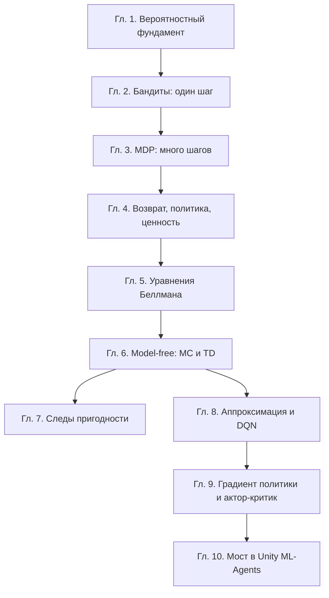

# Введение: От интуитивного кодирования к математическому осознанию

## Зачем это нужно

Агента в Unity можно обучить, не открыв ни одного учебника: собрать среду, выставить награды, запустить тренера, подобрать гиперпараметры перебором. Так работают многие, и до определённого момента это работает.

Момент наступает, когда обучение не сходится. Перебор перестаёт помогать, потому что параметров слишком много, а связи между ними неочевидны. Вопрос «почему агент застрял» без математики не имеет ответа: наблюдаемы только кривые в TensorBoard, а причина лежит в свойствах величин, которые эти кривые отражают.

Эта часть — переход от интуитивного кодирования к пониманию. Она не заменяет предыдущие: математический аппарат уже построен в [Частях I–V](../part-1-limits-series/index.md). Здесь он собирается в цельную картину алгоритмов RL — от простейшего случая с одним состоянием до актор-критика и моста в Unity ML-Agents.

## Обозначения

| Символ | Значение | Роль |
|--------|----------|------|
| $\enfVar{s} \in \mathcal{S}$ | состояние среды | `variable` |
| $a \in \mathcal{A}$ | действие агента | — |
| $\enfTgt{r}$ | награда | `target` |
| $\enfPar{\gamma}$ | коэффициент дисконтирования | `parameter` |
| $\enfPar{\alpha}$ | скорость обучения | `parameter` |
| $\enfOp{G}_t$ | возврат с шага $t$ | `operator` |
| $\enfOp{V}, \enfOp{Q}$ | функции ценности | `operator` |

Обозначения выдержаны едиными со всем пособием и соответствуют [соглашениям](../_meta/conventions.md).

## Три вопроса, ради которых написана часть

**Первый: почему агент не учится?** Ответ почти всегда лежит в одном из четырёх мест — марковское свойство нарушено, горизонт короче расстояния до цели, дисперсия оценки слишком велика, шаг обучения не согласован с масштабом ценностей. Каждое из четырёх диагностируется формулой, а не перебором.

**Второй: почему алгоритмов так много?** Потому что все они — варианты одной конструкции «оценка плюс шаг в сторону ошибки», различающиеся тем, что взято за цель и что за вес. Увидев это, список из тридцати аббревиатур превращается в таблицу из трёх столбцов.

**Третий: что означает каждая строка конфигурации?** Поля `gamma`, `lambd`, `epsilon`, `beta`, `learning_rate` — не настройки тренера, а параметры математических объектов. [Глава 10](10-unity-ml-agents-bridge.md) сопоставляет их один к одному.

## Как устроена часть

Порядок не случаен. Глава 2 разбирает задачу с одним состоянием — там уже виден компромисс между исследованием и использованием, но ещё нет последовательности решений. Глава 3 добавляет состояния, глава 4 — цель, глава 5 — рекурсию, связывающую всё вместе. Главы 6–9 снимают ограничения одно за другим: сначала знание модели среды, затем табличное представление, затем дискретность действий.

*Таблица 1. Что снимает каждая глава.*

| Глава | Ограничение до | Ограничение после |
|---|---|---|
| 2 | — | одно состояние |
| 3–5 | одно состояние | известна модель среды |
| 6 | известна модель | таблица состояний |
| 8 | таблица | дискретные действия |
| 9 | дискретные действия | — |

## Отношение к остальным частям

Часть VI опирается на предыдущие и почти не повторяет их.

- **Математический аппарат** — в [Части I](../part-1-limits-series/index.md) (сходимость), [Части II](../part-2-derivatives-gradient/index.md) (градиент), [Части III](../part-3-linear-algebra/index.md) (спектр и обусловленность), [Части IV](../part-4-probability/index.md) (ожидание и дисперсия).
- **Полный вывод градиента политики** — в [Части V](../part-5-policy-optimization/02-policy-gradient-derivation.md); [глава 9](09-policy-gradients.md) даёт его сжато и переходит к актор-критику.
- **Устройство PPO** — в [Части V](../part-5-policy-optimization/04-ppo.md); [глава 10](10-unity-ml-agents-bridge.md) связывает его с конфигурацией.

Если какая-то формула здесь кажется взявшейся ниоткуда, её вывод почти наверняка есть по ссылке.

## Что стоит запомнить

1. Перебор гиперпараметров перестаёт работать раньше, чем кажется; дальше нужны формулы, связывающие настройки с наблюдаемым поведением.
2. Алгоритмы RL — варианты одной конструкции «оценка плюс шаг в сторону ошибки»; различаются они целью и весом.
3. Главы части последовательно снимают ограничения: одно состояние, известная модель, табличное представление, дискретные действия.
4. Каждое поле конфигурации ML-Agents соответствует математическому объекту, а не является настройкой тренера.

## Проверка себя

1. Назовите четыре типичные причины того, что агент не обучается, и укажите, какой формулой проверяется каждая.
2. Почему задача с одним состоянием (бандит) заслуживает отдельной главы, если в RL состояний много?
3. Какое ограничение снимает переход от динамического программирования к TD-обучению?
4. В какой части пособия искать вывод формулы градиента политики и почему он не повторяется здесь?

## Навигация

- Часть: [VI · Фундаментальная математика RL](index.md)
- → Следующий: [Глава 1. Теоретико-вероятностный фундамент](01-probability-foundation.md)
- Оглавление: [SUMMARY](../SUMMARY.md) · [Карта](../_meta/mindmap.md)

## См. также (другие части пособия)

- [I · Введение](../part-1-limits-series/00-introduction.md) — общие темы: `rl-bridge`
- [I · 3. Пределы и ряды в контексте обучения с подкреплением](../part-1-limits-series/03-limits-in-rl.md) — общие темы: `rl-bridge`
- [VII · 1.1 Основные понятия](../part-7-deep-rl/01-core-concepts.md) — общие темы: `rl-bridge`

## Уроки курса

- _(прямых связей с уроками не выявлено)_

## Практика в этом репозитории

- Обзор лаборатории сред — `README.md`

## Источник на сайте

- [VI · Фундаментальная математика RL → Введение: От интуитивного кодирования к математическому осознанию](https://rl-cuber-unity-code.com/math-rl/module-5#введение-от-интуитивного-кодирования-к-математическому-осозн)
- Канонический якорь раздела (его использует реестр ссылок сайта): [`#введение`](https://rl-cuber-unity-code.com/math-rl/module-5#введение)
