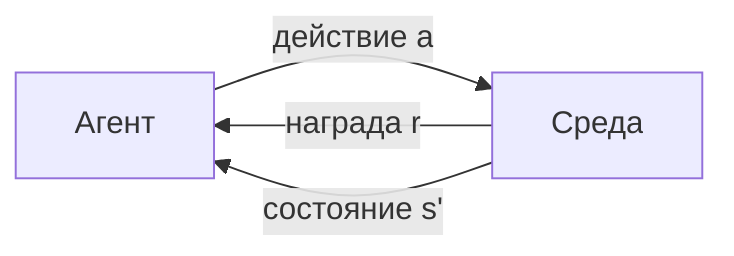

# Глава 3. Марковские процессы принятия решений (MDP)

## Зачем это нужно

Бандит из [главы 2](02-multi-armed-bandits.md) не имел состояний: каждый выбор был независим от предыдущих. Реальная задача устроена иначе — действие меняет положение агента, и следующее решение принимается уже в другой обстановке. Появляется то, чего у бандита не было: последствия.

MDP — формальная модель задач с последствиями. Её ценность не в общности, а в конкретности: как только среда описана пятёркой $\langle \mathcal{S}, \mathcal{A}, P, R, \gamma\rangle$, к ней применим весь аппарат этой части. Обратная сторона — описать среду в этом виде получается не всегда, и умение заметить, что не получилось, спасает недели отладки.

Общее изложение марковских процессов дано в [Части IV](../part-4-probability/03-markov-processes.md). Здесь акцент на другом: как пятёрка воплощается в коде среды и что происходит, когда воплощение неверно.

## Обозначения

| Символ | Значение | Роль |
|--------|----------|------|
| $\enfVar{s}, \enfVar{s}' \in \mathcal{S}$ | состояние и следующее состояние | `variable` |
| $a \in \mathcal{A}$ | действие агента | — |
| $P(\enfVar{s}'\mid \enfVar{s},a)$ | функция переходов | — |
| $R(\enfVar{s},a)$ | функция награды | — |
| $\enfTgt{r}_t$ | награда, полученная на шаге $t$ | `target` |
| $\enfPar{\gamma}$ | коэффициент дисконтирования | `parameter` |
| $\enfOp{G}_t$ | возврат с шага $t$ | `operator` |

## Определение

> [!definition] Определение 1. Марковский процесс принятия решений
> **MDP** — пятёрка $\langle \mathcal{S}, \mathcal{A}, P, R, \enfPar{\gamma}\rangle$:
> $\mathcal{S}$ — множество состояний; $\mathcal{A}$ — множество действий;
> $P(\enfVar{s}'\mid \enfVar{s}, a)$ — вероятность перехода; $R(\enfVar{s},a)$ — ожидаемая награда;
> $\enfPar{\gamma}\in[0,1)$ — коэффициент дисконтирования.

Взаимодействие устроено циклически: агент наблюдает $\enfVar{s}_t$, выбирает $a_t$, получает $\enfTgt{r}_{t+1}$ и оказывается в $\enfVar{s}_{t+1}$.

## Марковское свойство

> [!definition] Определение 2. Марковское свойство
> $$\mathbb{P}\bigl(\enfVar{s}_{t+1} \mid \enfVar{s}_t, a_t, \enfVar{s}_{t-1}, a_{t-1}, \dots\bigr) = \mathbb{P}\bigl(\enfVar{s}_{t+1} \mid \enfVar{s}_t, a_t\bigr).$$

Всё, что нужно для предсказания будущего, содержится в текущем состоянии. Прошлое не добавляет ничего.

> [!intuition] Свойство описания, а не мира
> Марковость — характеристика того, как выбрано состояние. Одна и та же физическая ситуация может быть марковской при одном описании и немарковской при другом. Значит, проверять свойство надо не у среды, а у вектора наблюдений, который агенту передают.
>
> Простой практический тест: **достаточно ли данных в наблюдении, чтобы человек, увидев только его, принял то же решение, что и увидев всю запись эпизода?** Если для ответа нужна история — свойство нарушено.

## Пятёрка в коде среды

Абстрактное определение имеет буквальное соответствие в коде агента Unity ML-Agents. Ниже — сопоставление, к которому [глава 10](10-unity-ml-agents-bridge.md) вернётся подробно.

*Таблица 1. Соответствие элементов MDP и кода среды.*

| Элемент MDP | Где живёт в коде | Типичная ошибка |
|---|---|---|
| $\mathcal{S}$, наблюдение | метод сбора наблюдений агента | забыта скорость или другая производная величина |
| $\mathcal{A}$, действия | описание пространства действий | несогласованность размерности с политикой |
| $P$, динамика | физика движка | недетерминизм, не отражённый в наблюдении |
| $R$, награда | вызовы начисления награды | награда за то, что агент не может контролировать |
| $\enfPar{\gamma}$ | поле `gamma` конфигурации | горизонт короче расстояния до цели |
| конец эпизода | вызов завершения эпизода | обрыв по лимиту без признака времени в наблюдении |

Строки 1 и 6 — самые частые нарушения марковости, и обе дёшево исправляются.

**Пример 1. GridWorld этого репозитория.** Сетка 5×5; состояние кодируется номером клетки $\enfVar{s} = 5r + c$, то есть числом от 0 до 24. Действия: четыре направления. Переходы детерминированы. Награды: шаг $-0{,}04$, цель $+1{,}0$, ловушка $-1{,}0$. Дисконт `gamma: 0.95`.

Проверим марковость. Всё, что влияет на будущее, — положение агента; оно целиком задано номером клетки. Свойство выполнено, и задача действительно табличная: $|\mathcal{S}| \cdot |\mathcal{A}| = 25 \cdot 4 = 100$ значений $\enfOp{Q}$, которые помещаются в массив. $\blacksquare$

**Пример 2. Что было бы при движении по инерции.** Добавим в ту же среду инерцию: агент продолжает двигаться в прежнем направлении, если не изменит его. Номер клетки перестаёт быть состоянием — исход действия теперь зависит и от предыдущего направления. Состояние приходится расширить до пары «клетка, направление», и число состояний вырастает вчетверо, до 100. Это цена марковости, и платить её приходится всегда: восстановление свойства увеличивает размерность.

## Эпизодические и непрерывающиеся задачи

Задача **эпизодическая**, если существуют терминальные состояния, после которых взаимодействие прекращается. Возврат тогда — конечная сумма, и $\enfPar{\gamma} = 1$ допустим.

Задача **непрерывающаяся**, если эпизод не заканчивается. Возврат становится рядом, и требование $\enfPar{\gamma} < 1$ обязательно — иначе сумма расходится ([Часть I](../part-1-limits-series/03-limits-in-rl.md)).

> [!warning] Обрыв по лимиту — не то же самое, что завершение
> Многие среды обрывают эпизод по достижении лимита шагов. С точки зрения математики это не терминальное состояние: агент не «закончил», его просто остановили. Обрабатывать два случая одинаково — ошибка, дающая систематическое смещение оценки ценности: агент учится тому, что после лимита будущего нет, хотя оно есть.
>
> Правильная обработка: при завершении по достижении цели цель равна $\enfTgt{r}$; при обрыве по лимиту — $\enfTgt{r} + \enfPar{\gamma}\,\enfOp{V}(\enfVar{s}')$, то есть ценность обрезанного будущего учитывается. В ML-Agents за это отвечает различение сигналов о завершении эпизода и о прерывании; в самодельных реализациях это одна из самых частых ошибок.

## Частичная наблюдаемость

Если агент видит не состояние, а его функцию, задача становится **частично наблюдаемым MDP** (POMDP). Тогда оптимальная политика в общем случае зависит от всей истории, и три обходных пути таковы.

1. **Расширить наблюдение** — добавить недостающие величины. Дёшево и решает большинство практических случаев.
2. **Стек кадров** — подавать несколько последних наблюдений вместо одного. Восстанавливает производные величины неявно; в ML-Agents задаётся числом складываемых наблюдений.
3. **Рекуррентная сеть** — хранить скрытое состояние. Наиболее общий и наиболее дорогой путь.

Порядок перечисления — порядок, в котором стоит пробовать.

## Что стоит запомнить

1. MDP — пятёрка $\langle \mathcal{S}, \mathcal{A}, P, R, \gamma\rangle$; описав среду в этом виде, к ней применим весь аппарат RL.
2. Марковское свойство — характеристика наблюдения, а не мира; проверять его надо у вектора, который получает агент.
3. Восстановление марковости всегда увеличивает размерность состояния — это неизбежная плата.
4. Обрыв эпизода по лимиту шагов не является терминальным состоянием; смешивание двух случаев систематически смещает оценку ценности.
5. При частичной наблюдаемости пробовать средства следует по возрастанию цены: расширение наблюдения, стек кадров, рекуррентная сеть.

## Проверка себя

1. Выпишите пятёрку MDP для GridWorld 5×5. Сколько значений содержит таблица $Q$?
2. Агент управляет тележкой и видит только её положение. Марковская ли задача? Какое минимальное расширение наблюдения её исправляет?
3. Почему в примере 2 число состояний выросло именно вчетверо?
4. Эпизод обрывается по лимиту 1000 шагов. Какую цель подставлять в обновление ценности и почему не $r$?
5. Наблюдение содержит только текущий кадр камеры. Перечислите три способа восстановить марковость в порядке возрастания стоимости.

## Навигация

- Часть: [VI · Фундаментальная математика RL](index.md)
- ← Предыдущий: [Глава 2. Многорукие бандиты: Исследование vs Использование](02-multi-armed-bandits.md)
- → Следующий: [Глава 4. Возврат, политики и функции ценности](04-return-policy-value.md)
- Оглавление: [SUMMARY](../SUMMARY.md) · [Карта](../_meta/mindmap.md)

## См. также (другие части пособия)

- [IV · 3. Марковские процессы](../part-4-probability/03-markov-processes.md) — общие темы: `markov`, `mdp`
- [I · 4. Уравнения Беллмана и дисконтирование](../part-1-limits-series/04-bellman-and-discounting.md) — общие темы: `mdp`
- [IV · 4. Функции ценности и уравнения Беллмана](../part-4-probability/04-value-functions-bellman.md) — общие темы: `mdp`

## Уроки курса

- **[Урок 1.1. Что такое обучение с подкреплением?](https://rl-cuber-unity-code.com/courses/1-1)** — Формальное определение MDP, V/Q функции ⟵ *связь уже есть на сайте*
- **[Урок 1.3. Марковские процессы принятия решений (MDP)](https://rl-cuber-unity-code.com/courses/1-3)** — Формальное описание MDP-среды ⟵ *связь уже есть на сайте*

## Практика в этом репозитории

- GridWorld 5×5 — MDP на индексах клеток — `Assets/ML-ENVIRONMENTS/02-Examples/Greed_world/INSTRUCTIONS.md`
- GridWorld: детерминированные переходы, slipProbability — `Assets/ML-ENVIRONMENTS/02-Examples/Greed_world/Scripts/GridWorldEnvironment.cs`

## Источник на сайте

- [VI · Фундаментальная математика RL → Глава 3. Марковские процессы принятия решений (MDP)](https://rl-cuber-unity-code.com/math-rl/module-5#глава-3-марковские-процессы-принятия-решений-mdp)
- Канонический якорь раздела (его использует реестр ссылок сайта): [`#глава-3`](https://rl-cuber-unity-code.com/math-rl/module-5#глава-3)
