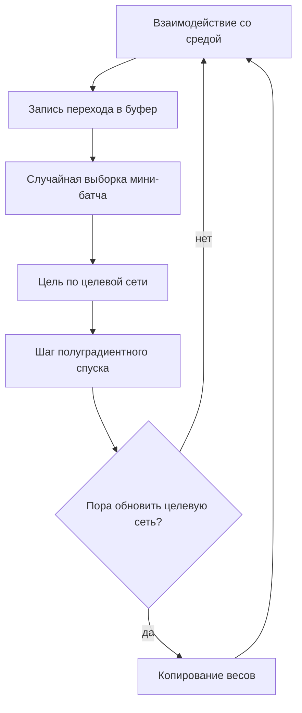

# Глава 8. Аппроксимация функций и Deep RL

## Зачем это нужно

Всё предыдущее изложение предполагало таблицу: каждой паре «состояние — действие» отведена собственная ячейка. Для GridWorld 5×5 это 100 чисел — прекрасно. Для шахмат число состояний превышает $10^{40}$, для среды с непрерывными координатами оно бесконечно.

Дело не только в памяти. Табличное представление не умеет **обобщать**: два почти одинаковых состояния — это две независимые ячейки, и опыт, полученный в одной, ничего не сообщает о другой. Агент, научившийся балансировать при отклонении $0{,}1$ радиана, не знает ничего об отклонении $0{,}1001$.

Аппроксимация функции решает обе задачи разом. Ценой становятся гарантии: теорема о сходимости Q-обучения, доказанная для таблиц, перестаёт действовать, и в дело вступает смертельная триада. Глава объясняет, что именно ломается и какими инженерными приёмами это чинят.

## Обозначения

| Символ | Значение | Роль |
|--------|----------|------|
| $\enfVar{s}, \enfVar{s}'$ | состояния | `variable` |
| $a$ | действие | — |
| $\enfPar{w}$ | параметры сети-оценщика | `parameter` |
| $\enfPar{w}^{-}$ | параметры целевой сети | `parameter` |
| $\enfPar{\alpha}, \enfPar{\gamma}$ | скорость обучения и дисконт | `parameter` |
| $\enfTgt{y}$ | цель обучения | `target` |
| $\enfTgt{\mathcal{L}}$ | функция потерь | `target` |
| $\enfOp{Q}(\enfVar{s},a;\enfPar{w})$ | приближённая ценность действия | `operator` |
| $\enfOp{\nabla}$ | градиент по параметрам | `operator` |

## От таблицы к функции

Вместо массива значений хранится параметрическая функция $\enfOp{Q}(\enfVar{s},a;\enfPar{w})$ с числом параметров, много меньшим числа состояний.

*Таблица 1. Что меняется при переходе.*

| Свойство | Таблица | Аппроксимация |
|---|---|---|
| Память | $\lvert\mathcal{S}\rvert \cdot \lvert\mathcal{A}\rvert$ | число весов |
| Обобщение | отсутствует | есть |
| Обновление одной пары | не влияет на другие | влияет на все |
| Гарантия сходимости | есть | отсутствует |

Третья строка — источник и пользы, и вреда. Польза: опыт переносится на похожие состояния. Вред: улучшив оценку в одном месте, можно ухудшить её в другом, и процесс способен не сойтись.

**Линейная аппроксимация.** Простейший случай: $\enfOp{Q}(\enfVar{s},a;\enfPar{w}) = \enfPar{w}^{\top}\boldsymbol{\phi}(\enfVar{s},a)$, где $\boldsymbol{\phi}$ — вектор признаков. Качество ограничено линейной оболочкой признаков ([Часть III](../part-3-linear-algebra/01-vectors.md)): если истинная функция ценности в неё не попадает, точного приближения не будет ни при каких весах.

**Нейросеть.** Признаки не задаются, а выучиваются. Именно поэтому глубокое RL справляется с изображениями и сырыми показаниями датчиков, где придумать признаки вручную невозможно.

## Полуградиентное обучение

Естественная идея — минимизировать квадрат TD-ошибки. Обозначим цель

$$
\enfTgt{y} = \enfTgt{r} + \enfPar{\gamma}\max_{a'}\enfOp{Q}(\enfVar{s}',a';\enfPar{w})
$$

и возьмём потери $\enfTgt{\mathcal{L}} = \tfrac{1}{2}\bigl(\enfTgt{y} - \enfOp{Q}(\enfVar{s},a;\enfPar{w})\bigr)^{2}$. Продифференцировав по $\enfPar{w}$ и **считая цель постоянной**, получаем

$$
\enfPar{w} \leftarrow \enfPar{w} + \enfPar{\alpha}\bigl(\enfTgt{y} - \enfOp{Q}(\enfVar{s},a;\enfPar{w})\bigr)\ \enfOp{\nabla}_{w}\enfOp{Q}(\enfVar{s},a;\enfPar{w}).
$$

> [!warning] Это не градиент
> Цель $\enfTgt{y}$ содержит $\enfPar{w}$, и её производную мы отбросили сознательно. Значит, правило не является градиентом никакой функции — оно **полуградиентно**. Практическое следствие: аргументы о сходимости градиентного спуска из [Части II](../part-2-derivatives-gradient/03-gradient-descent.md) здесь неприменимы, а вместе с ними и уверенность в том, что процесс куда-либо сойдётся.
>
> Учитывать зависимость цели от параметров (полный градиент) технически возможно, но на практике даёт худшие результаты: обновление начинает подгонять цель под оценку вместо обратного.

## Смертельная триада

> [!definition] Определение 1. Смертельная триада
> Расходимость обучения возможна при одновременном наличии трёх факторов: **аппроксимация функции**, **обучение вне политики** и **бутстрэппинг** (использование собственной оценки в цели). Любые два фактора без третьего безопасны.

*Таблица 2. Присутствие факторов в методах.*

| Метод | Аппроксимация | Вне политики | Бутстрэппинг | Устойчивость |
|---|---|---|---|---|
| Табличное Q-обучение | нет | да | да | доказана |
| Монте-Карло с сетью | да | да | нет | устойчиво |
| TD с сетью, on-policy | да | нет | да | обычно устойчиво |
| DQN | да | да | да | требует приёмов |

Последняя строка — предмет остальной части главы. DQN сочетает все три фактора, и его работоспособность обеспечена не теорией, а несколькими инженерными решениями.

## DQN

Алгоритм Мниха и соавторов (2015), впервые обучивший агента играть в игры Atari по сырому изображению. Три приёма, каждый из которых бьёт по конкретной болезни.

### Буфер воспроизведения

Переходы $(\enfVar{s},a,\enfTgt{r},\enfVar{s}')$ складываются в буфер, а обучение идёт на случайных выборках из него.

**Какую болезнь лечит.** Последовательные переходы сильно коррелированы, а градиентный спуск предполагает независимые выборки: мини-батч из подряд идущих кадров оценивает градиент смещённо и заставляет сеть «забывать» старое. Случайная выборка из буфера разрывает корреляцию.

**Побочная выгода.** Каждый переход используется многократно, что резко снижает число требуемых взаимодействий со средой. Это возможно только благодаря обучению вне политики: старые переходы собраны старой политикой, и для Q-обучения это допустимо.

### Целевая сеть

Цель вычисляется по замороженной копии параметров:

$$
\enfTgt{y} = \enfTgt{r} + \enfPar{\gamma}\max_{a'}\enfOp{Q}(\enfVar{s}',a';\enfPar{w}^{-}),
$$

где $\enfPar{w}^{-}$ обновляется копированием $\enfPar{w}$ раз в несколько тысяч шагов.

**Какую болезнь лечит.** Без заморозки цель движется одновременно с оценкой: сеть гонится за мишенью, которую сама и двигает. Возникает положительная обратная связь — рост оценки поднимает цель, что поднимает оценку. Заморозка делает цель неподвижной между обновлениями, превращая задачу в последовательность обычных регрессий.

### Обрезка и масштаб наград

Награды приводят к диапазону порядка единицы, а норму градиента ограничивают. Обоснование — оценка $|\enfOp{Q}| \le r_{\max}/(1-\enfPar{\gamma})$ из [Части I](../part-1-limits-series/02-infinite-series.md): при $\gamma = 0{,}99$ и наградах порядка 100 выходы сети должны достигать 10 000, что для нейросети неудобный диапазон.

## Переоценка и Double DQN

Отдельная беда, не связанная с триадой.

> [!theorem] Утверждение 2. Смещение максимума
> Для случайных величин $\enfVar{X}_i$ выполнено $\mathbb{E}\bigl[\max_i \enfVar{X}_i\bigr] \ge \max_i \mathbb{E}[\enfVar{X}_i]$.

Оператор максимума и математическое ожидание не перестановочны, и максимум зашумлённых оценок систематически завышен. В цели Q-обучения стоит именно $\max_{a'}\enfOp{Q}$, поэтому цель систематически завышена, и завышение накапливается через бутстрэппинг.

**Пример.** Пусть все действия в состоянии имеют истинную ценность 0, а оценки зашумлены с нулевым средним и разбросом 1. Максимум из четырёх таких оценок в среднем равен примерно $+1{,}03$, хотя истинный максимум равен нулю. Ошибка возникает не из плохого обучения, а из самой операции максимума. $\blacksquare$

**Double DQN** разделяет выбор действия и его оценку:

$$
\enfTgt{y} = \enfTgt{r} + \enfPar{\gamma}\,\enfOp{Q}\Bigl(\enfVar{s}',\ \arg\max_{a'}\enfOp{Q}(\enfVar{s}',a';\enfPar{w});\ \enfPar{w}^{-}\Bigr).
$$

Действие выбирается основной сетью, а оценивается целевой. Шум двух сетей независим, поэтому систематического завышения не возникает.

## Схема обучения

## Что стоит запомнить

1. Аппроксимация даёт обобщение и снимает ограничение на число состояний, но лишает гарантий сходимости.
2. Обновление правил TD при аппроксимации полуградиентно: производная цели отбрасывается сознательно, и минимизируемой функции не существует.
3. Смертельная триада — аппроксимация, обучение вне политики и бутстрэппинг; любые два фактора без третьего безопасны.
4. Буфер воспроизведения разрывает корреляцию последовательных переходов, целевая сеть останавливает погоню за движущейся мишенью.
5. Максимум зашумлённых оценок систематически завышен; Double DQN устраняет завышение, разделяя выбор и оценку действия.

## Проверка себя

1. Почему табличное Q-обучение устойчиво, хотя содержит два фактора триады?
2. Что произойдёт, если обучать DQN на подряд идущих кадрах без буфера воспроизведения?
3. Целевую сеть обновляют каждые 10 шагов вместо 10 000. Какое свойство приёма при этом теряется?
4. Награды в среде лежат в диапазоне $[-100, 100]$, `gamma: 0.99`. Оцените диапазон выходов сети и объясните, почему награды масштабируют.
5. Объясните на примере, почему $\mathbb{E}[\max_i X_i] \ge \max_i \mathbb{E}[X_i]$, и как Double DQN обходит это неравенство.

## Навигация

- Часть: [VI · Фундаментальная математика RL](index.md)
- ← Предыдущий: [Глава 7. Следы пригодности (Eligibility Traces)](07-eligibility-traces.md)
- → Следующий: [Глава 9. Методы градиента политики (Policy Gradients)](09-policy-gradients.md)
- Оглавление: [SUMMARY](../SUMMARY.md) · [Карта](../_meta/mindmap.md)

## См. также (другие части пособия)

- [VII · 1.2 Обзор алгоритмов RL](../part-7-deep-rl/02-algorithms-overview.md) — общие темы: `deep-rl`, `dqn`
- [VII · 1.1 Основные понятия](../part-7-deep-rl/01-core-concepts.md) — общие темы: `deep-rl`

## Уроки курса

- [Урок 1.5. CartPole — твой первый RL-агент](https://rl-cuber-unity-code.com/courses/1-5) — *предлагаемая связь*
- [Урок 1.6. DQN с нуля на PyTorch](https://rl-cuber-unity-code.com/courses/1-6) — *предлагаемая связь*

## Практика в этом репозитории

- Полносвязная сеть вместо таблицы — `python/labrl/nets/mlp.py`
- Double DQN: буфер, целевая сеть, функция Хубера — `python/labrl/algos/dqn.py`
- double_dqn: true, target_update_interval: 500 — `configs/E03_RollerBall__dqn.yaml`
- Табличная политика как линейный слой — граница между таблицей и сетью — `python/labrl/nets/tabular.py`

## Источник на сайте

- [VI · Фундаментальная математика RL → Глава 8. Аппроксимация функций и Deep RL](https://rl-cuber-unity-code.com/math-rl/module-5#глава-8-аппроксимация-функций-и-deep-rl)
- Канонический якорь раздела (его использует реестр ссылок сайта): [`#глава-8`](https://rl-cuber-unity-code.com/math-rl/module-5#глава-8)
