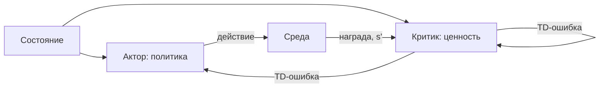

# Глава 9. Методы градиента политики (Policy Gradients)

## Зачем это нужно

DQN из [главы 8](08-function-approximation.md) снял ограничение на число состояний, но одно осталось: в цели стоит $\max_{a'}$, а максимум по непрерывному множеству не вычисляется. Управление моментом на суставе, силой тяги, углом поворота — всё это остаётся за пределами метода.

Глава снимает последнее ограничение. Политика обучается напрямую, максимум по действиям исчезает, непрерывное управление становится доступно. Полный вывод формулы дан в [Части V](../part-5-policy-optimization/02-policy-gradient-derivation.md); здесь он приведён сжато, а основное внимание уделено архитектуре актор-критик, которая соединяет оба семейства и лежит в основе PPO.

## Обозначения

| Символ | Значение | Роль |
|--------|----------|------|
| $\enfVar{s}$ | состояние | `variable` |
| $a$ | действие | — |
| $\pi_{\theta}(a\mid \enfVar{s})$ | параметризованная политика | — |
| $\enfPar{\theta}$ | параметры актора | `parameter` |
| $\enfPar{w}$ | параметры критика | `parameter` |
| $\enfPar{\alpha}_{\theta}, \enfPar{\alpha}_{w}$ | скорости обучения актора и критика | `parameter` |
| $\enfPar{\gamma}$ | коэффициент дисконтирования | `parameter` |
| $\enfTgt{J}(\enfPar{\theta})$ | целевая функция | `target` |
| $\enfTgt{\delta}_t$ | TD-ошибка | `target` |
| $\enfOp{G}_t$ | возврат | `operator` |
| $\enfOp{V}, \enfOp{Q}, \enfOp{A}$ | ценность состояния, действия, преимущество | `operator` |

## Параметризация политики

**Дискретные действия.** Сеть выдаёт вектор оценок, softmax превращает его в распределение. Все вероятности положительны — необходимое условие для логарифма.

**Непрерывные действия.** Сеть выдаёт среднее $\mu(\enfVar{s};\enfPar{\theta})$; разброс задаётся отдельным обучаемым параметром. Действие берётся из нормального распределения. Так устроена политика RollerAgent этого репозитория: два непрерывных выхода — компоненты прикладываемой силы.

Полезно сразу выписать градиент логарифма для обоих случаев, поскольку именно он входит в правило обучения.

*Таблица 1. Градиент логарифма вероятности.*

| Политика | $\nabla_{\theta}\ln\pi_{\theta}(a\mid s)$ | Смысл |
|---|---|---|
| Softmax | $\boldsymbol{\phi}(s,a) - \sum_{b}\pi_{\theta}(b\mid s)\boldsymbol{\phi}(s,b)$ | признак выбранного минус средний признак |
| Нормальная | $\dfrac{(a - \mu)}{\sigma^{2}}\ \nabla_{\theta}\mu$ | отклонение действия от среднего, нормированное на разброс |

Вторая строка читается прямо: если действие оказалось выше среднего и результат хорош, среднее сдвигается вверх. Деление на $\sigma^{2}$ означает, что при большом разбросе отдельное отклонение значит меньше.

## Логарифмический трюк и теорема

> [!theorem] Лемма 1. Тождество логарифмической производной
> Для положительной дифференцируемой $p(\enfPar{\theta})$ верно $\enfOp{\nabla}p = p\,\enfOp{\nabla}\ln p$.

Тождество следует из правила цепочки: $\enfOp{\nabla}\ln p = \enfOp{\nabla}p / p$. Его роль — превратить градиент вероятности, не оцениваемый по выборке, в математическое ожидание, которое оценивается средним.

> [!theorem] Теорема 2. Градиент политики
> $$\enfOp{\nabla}_{\theta}\enfTgt{J}(\enfPar{\theta}) = \mathbb{E}_{\pi_{\theta}}\!\left[\sum_{t\ge 0}\enfOp{\nabla}_{\theta}\ln\pi_{\theta}(a_t\mid \enfVar{s}_t)\ \enfOp{Q}(\enfVar{s}_t,a_t)\right].$$

Ключевое обстоятельство: в правой части нет производной модели среды и нет производной распределения состояний. При логарифмировании вероятности траектории слагаемые, отвечающие динамике среды, не зависят от $\enfPar{\theta}$ и обращаются в ноль. Полный вывод в шесть шагов — в [Части V](../part-5-policy-optimization/02-policy-gradient-derivation.md).

> [!intuition] Как читать формулу
> Это взвешенное обучение с учителем. Множитель $\enfOp{\nabla}\ln\pi_{\theta}$ — в точности то, что вычисляет обычная классификация с кросс-энтропийными потерями, если считать выбранное действие «правильным ответом». Разница в весе: агент сам решает, насколько сильно поощрить каждый пример, и решает это по полученной ценности.

## REINFORCE

Простейший алгоритм по теореме 2: множителем берётся наблюдённый возврат.

$$
\enfPar{\theta} \leftarrow \enfPar{\theta} + \enfPar{\alpha}_{\theta}\,\enfOp{G}_t\ \enfOp{\nabla}_{\theta}\ln\pi_{\theta}(a_t\mid \enfVar{s}_t).
$$

Алгоритм несмещён и не требует модели среды. И почти не работает: множитель $\enfOp{G}_t$ имеет огромную дисперсию, поэтому для получения полезного сигнала нужны десятки тысяч эпизодов.

Два улучшения, выведенные в [Части V](../part-5-policy-optimization/02-policy-gradient-derivation.md), обязательны на практике.

1. **Reward-to-go.** Использовать возврат с момента $t$, а не всего эпизода: прошлые награды не зависят от текущего действия и вносят в ожидание ноль, а в дисперсию — вклад.
2. **Базис.** Вычесть функцию, зависящую только от состояния. Ожидание не меняется, дисперсия падает.

## Актор-критик

Естественный выбор базиса — функция ценности состояния. Но она неизвестна, и её приходится учить — отдельной сетью. Так возникает архитектура из двух компонент.

> [!definition] Определение 3. Актор-критик
> **Актор** — сеть политики с параметрами $\enfPar{\theta}$, выбирающая действия.
> **Критик** — сеть ценности с параметрами $\enfPar{w}$, оценивающая $\enfOp{V}(\enfVar{s};\enfPar{w})$.
> Обновления выполняются совместно:
> $$\enfTgt{\delta}_t = \enfTgt{r}_{t+1} + \enfPar{\gamma}\,\enfOp{V}(\enfVar{s}_{t+1};\enfPar{w}) - \enfOp{V}(\enfVar{s}_t;\enfPar{w}),$$
> $$\enfPar{w} \leftarrow \enfPar{w} + \enfPar{\alpha}_{w}\,\enfTgt{\delta}_t\,\enfOp{\nabla}_{w}\enfOp{V}(\enfVar{s}_t;\enfPar{w}), \qquad
> \enfPar{\theta} \leftarrow \enfPar{\theta} + \enfPar{\alpha}_{\theta}\,\enfTgt{\delta}_t\,\enfOp{\nabla}_{\theta}\ln\pi_{\theta}(a_t\mid \enfVar{s}_t).$$

> [!intuition] Почему TD-ошибка встала на место преимущества
> Ожидание TD-ошибки при данных состоянии и действии равно преимуществу:
> $$\mathbb{E}\bigl[\enfTgt{r}_{t+1} + \enfPar{\gamma}\enfOp{V}(\enfVar{s}_{t+1}) \mid \enfVar{s}_t, a_t\bigr] - \enfOp{V}(\enfVar{s}_t) = \enfOp{Q}(\enfVar{s}_t,a_t) - \enfOp{V}(\enfVar{s}_t) = \enfOp{A}(\enfVar{s}_t,a_t),$$
> где первое равенство — уравнение Беллмана для $\enfOp{Q}$. Значит, TD-ошибка — несмещённая оценка преимущества при точном критике, и получить её стоит одного перехода вместо целого эпизода.
>
> Отсюда и разделение труда: критик отвечает на вопрос «чего здесь ожидать вообще», актор — «насколько это действие лучше ожидаемого». Знак TD-ошибки прямо говорит актору, поощрять действие или наказывать.

*Таблица 2. Три подхода в сравнении.*

| Свойство | REINFORCE | Актор-критик | DQN |
|---|---|---|---|
| Смещение | нет | есть (от критика) | есть |
| Дисперсия | очень высокая | умеренная | низкая |
| Обновление | в конце эпизода | на каждом шаге | на каждом шаге |
| Непрерывные действия | да | да | нет |
| Переиспользование опыта | нет | ограниченно | да |

## Путь к PPO

Актор-критик обновляет политику после каждого шага и потому расходует данные быстро. PPO делает следующий шаг: он собирает порцию опыта, оценивает преимущества через GAE, а затем выполняет по этой порции **несколько** эпох обучения, удерживая политику вблизи исходной клиповым ограничением.

Иными словами, PPO — это актор-критик плюс механизм безопасного переиспользования данных. Подробный разбор с формулами и гиперпараметрами — в [Части V](../part-5-policy-optimization/04-ppo.md), а связь с полями конфигурации ML-Agents — в [следующей главе](10-unity-ml-agents-bridge.md).

## Что стоит запомнить

1. Методы градиента политики снимают ограничение на непрерывность действий, поскольку в них нет операции максимума по действиям.
2. Тождество логарифмической производной превращает невычислимый градиент вероятности в оцениваемое по выборке ожидание.
3. Динамика среды исчезает из формулы при логарифмировании, поэтому метод безмодельный.
4. TD-ошибка при точном критике является несмещённой оценкой преимущества — на этом стоит вся архитектура актор-критик.
5. PPO есть актор-критик, дополненный механизмом безопасного многократного использования одной порции данных.

## Проверка себя

1. Почему в правиле обучения политики стоит знак плюс, а не минус, как в градиентном спуске?
2. Выпишите $\nabla_{\theta}\ln\pi_{\theta}$ для нормальной политики и объясните смысл деления на $\sigma^{2}$.
3. Докажите, что ожидание TD-ошибки при данных состоянии и действии равно преимуществу.
4. Какое смещение вносит критик и почему на него соглашаются?
5. Что мешает применить DQN к управлению моментом на суставе робота и как это ограничение обходит актор-критик?

## Навигация

- Часть: [VI · Фундаментальная математика RL](index.md)
- ← Предыдущий: [Глава 8. Аппроксимация функций и Deep RL](08-function-approximation.md)
- → Следующий: [Глава 10. Мост к практике: Unity ML-Agents](10-unity-ml-agents-bridge.md)
- Оглавление: [SUMMARY](../SUMMARY.md) · [Карта](../_meta/mindmap.md)

## См. также (другие части пособия)

- [V · Лекция 2. Вывод градиента политики](../part-5-policy-optimization/02-policy-gradient-derivation.md) — общие темы: `advantage`, `log-trick`, `policy-gradient`, `reinforce`
- [II · § 4. Применение в RL: Policy Gradient](../part-2-derivatives-gradient/04-policy-gradient-application.md) — общие темы: `policy-gradient`
- [V · Лекция 1. Основы RL и оптимизация политики](../part-5-policy-optimization/01-policy-optimization-basics.md) — общие темы: `policy-gradient`

## Уроки курса

- **[Урок 2.2. PPO — реализация с нуля](https://rl-cuber-unity-code.com/courses/2-2)** — Математика GAE и advantage estimation ⟵ *связь уже есть на сайте*
- **[Урок 3.1. SAC — Soft Actor-Critic](https://rl-cuber-unity-code.com/courses/3-1)** — Математика soft value функций ⟵ *связь уже есть на сайте*
- [Урок 2.1. Policy Gradient и теорема градиента](https://rl-cuber-unity-code.com/courses/2-1) — *предлагаемая связь*
- [Урок 2.3. Непрерывные действия и Actor-Critic](https://rl-cuber-unity-code.com/courses/2-3) — *предлагаемая связь*

## Практика в этом репозитории

- REINFORCE с базисом — `python/labrl/algos/reinforce.py`
- PPO целиком: отношение, клиппинг, GAE, несколько эпох — `python/labrl/algos/ppo.py`
- Гауссова политика: среднее и обучаемое log σ — `python/labrl/nets/gaussian_policy.py`
- Сборщик еды: гибридные действия и GridSensor — `unity/MLAgentsLab/Assets/Envs/E05_FoodCollector/Scripts/FoodCollectorAgent.cs`

## Источник на сайте

- [VI · Фундаментальная математика RL → Глава 9. Методы градиента политики (Policy Gradients)](https://rl-cuber-unity-code.com/math-rl/module-5#глава-9-методы-градиента-политики-policy-gradients)
- Канонический якорь раздела (его использует реестр ссылок сайта): [`#глава-9`](https://rl-cuber-unity-code.com/math-rl/module-5#глава-9)
