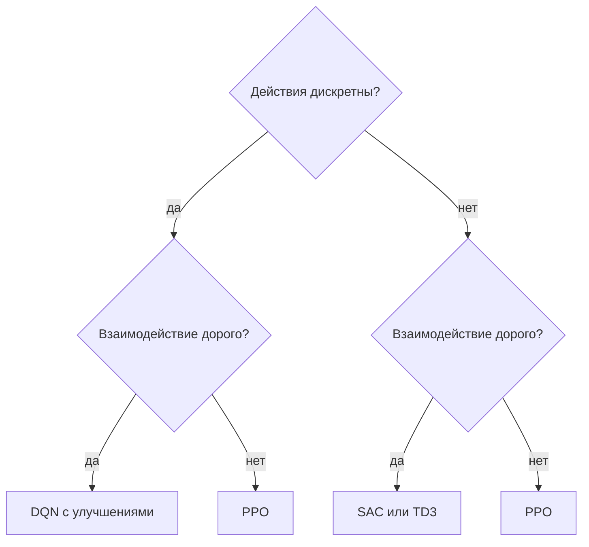

# 1.2 Обзор алгоритмов RL

## Зачем это нужно

Названий алгоритмов много, и список аббревиатур запомнить нельзя. Зато можно понять принцип их порождения: почти каждый метод — предыдущий плюс устранение одной конкретной беды. Беда называется, приём описывается, аббревиатура получается.

Раздел выстраивает эту генеалогию. После него по названию алгоритма можно сказать, от чего он лечит, а по симптому обучения — какой алгоритм стоит попробовать.

## Обозначения

| Символ | Значение | Роль |
|--------|----------|------|
| $\enfVar{s}, \enfVar{s}'$ | состояния | `variable` |
| $a$ | действие | — |
| $\enfPar{w}, \enfPar{w}^{-}$ | параметры сети и целевой сети | `parameter` |
| $\enfPar{\theta}$ | параметры политики | `parameter` |
| $\enfPar{\gamma}$ | коэффициент дисконтирования | `parameter` |
| $\enfTgt{r}$ | награда | `target` |
| $\enfTgt{y}$ | цель обучения | `target` |
| $\enfOp{Q}, \enfOp{V}, \enfOp{A}$ | ценность действия, состояния, преимущество | `operator` |
| $\enfOp{H}$ | энтропия политики | `operator` |

## Deep Q-Network

Отправная точка семейства. Q-обучение с нейросетью, буфером воспроизведения и целевой сетью; предложен Мнихом и соавторами (2015). Цель обучения:

$$
\enfTgt{y} = \enfTgt{r} + \enfPar{\gamma}\max_{a'}\enfOp{Q}(\enfVar{s}',a';\enfPar{w}^{-}).
$$

Устройство и назначение каждого приёма разобраны в [Части VI](../part-6-fundamental-rl/08-function-approximation.md). Ограничение метода одно и принципиальное: максимум по действиям требует их дискретности.

## Улучшения DQN

*Таблица 1. Что чинит каждая надстройка.*

| Метод | Беда | Приём |
|---|---|---|
| Double DQN | завышение из-за максимума зашумлённых оценок | выбор действия основной сетью, оценка — целевой |
| Dueling DQN | ценность состояния переучивается для каждого действия | разделение на $\enfOp{V}(\enfVar{s})$ и $\enfOp{A}(\enfVar{s},a)$ |
| Приоритетное воспроизведение | редкие важные переходы теряются в буфере | выборка с вероятностью, растущей с модулем TD-ошибки |
| Многошаговые цели | сигнал медленно распространяется | $n$ настоящих наград перед бутстрэппингом |
| Распределённое RL | среднее скрывает форму распределения возврата | оценка всего распределения, а не ожидания |
| Шумные сети | $\varepsilon$-жадное исследование грубо | обучаемый шум в весах вместо случайного выбора |

**Dueling DQN** стоит пояснить отдельно. Сеть выдаёт две величины и собирает из них ценность:

$$
\enfOp{Q}(\enfVar{s},a) = \enfOp{V}(\enfVar{s}) + \enfOp{A}(\enfVar{s},a) - \frac{1}{\lvert\mathcal{A}\rvert}\sum_{b}\enfOp{A}(\enfVar{s},b).
$$

Вычитание среднего преимущества нужно для однозначности: без него $\enfOp{V}$ и $\enfOp{A}$ определены с точностью до общей константы, и обучение размывается между ними. Выигрыш метода — в состояниях, где выбор действия почти безразличен: ценность состояния учится один раз, а не отдельно в каждой из $|\mathcal{A}|$ ячеек.

**Приоритетное воспроизведение** опирается на наблюдение: переход с большой TD-ошибкой несёт больше информации. Выборка с приоритетом вносит смещение — распределение выборки перестаёт совпадать с распределением буфера, — и его компенсируют весами важности, тем же приёмом выборки по значимости, что применён в [PPO](../part-5-policy-optimization/04-ppo.md).

**Rainbow** — объединение шести перечисленных улучшений в одном алгоритме (Хессел и соавторы, 2018); работа примечательна не столько результатом, сколько разбором вклада каждой составляющей.

## Методы с непрерывными действиями

Все методы выше требуют максимума по действиям. Следующее семейство от этого свободно.

*Таблица 2. Алгоритмы для непрерывного управления.*

| Метод | Тип | Ключевая идея | Опыт |
|---|---|---|---|
| A2C, A3C | актор-критик, на политике | параллельные среды вместо буфера | не переиспользуется |
| TRPO | на политике | ограничение шага через расхождение распределений | не переиспользуется |
| PPO | на политике | то же ограничение, но обрезкой отношения | переиспользуется несколько эпох |
| DDPG | актор-критик, вне политики | детерминированный актор вместо максимума | переиспользуется |
| TD3 | вне политики | два критика и минимум из них против завышения | переиспользуется |
| SAC | вне политики | максимизация награды **и** энтропии | переиспользуется |

**A3C и A2C** решают проблему коррелированных данных иначе, чем DQN: вместо буфера используются параллельные копии среды, чьи переходы независимы между собой. Отсюда практическая ценность параллельных сред в Unity.

**TRPO и PPO** ограничивают величину шага в пространстве политик, а не параметров. Различие важно: одинаковое изменение весов может дать и незаметное, и катастрофическое изменение поведения. TRPO решает задачу с ограничением точно и дорого, PPO приближает её обрезкой отношения вероятностей — разбор в [Части V](../part-5-policy-optimization/04-ppo.md).

**DDPG** обходит максимум так: актор выдаёт **детерминированное** действие, которое и считается наилучшим, а критик оценивает пару. Исследование добавляется шумом извне. Метод известен неустойчивостью, и **TD3** её лечит тремя приёмами, главный из которых — два независимых критика с выбором минимума, что противодействует завышению.

**SAC** максимизирует не только награду, но и энтропию политики:

$$
\enfTgt{J}(\enfPar{\theta}) = \mathbb{E}\!\left[\sum_t \enfTgt{r}_t + \enfPar{\alpha}\,\enfOp{H}\bigl(\pi_{\theta}(\cdot\mid \enfVar{s}_t)\bigr)\right].
$$

Энтропия входит не как добавка к градиенту, а внутрь определения оптимальности: агент ищет наиболее случайную политику среди достаточно хороших. Практический результат — устойчивое исследование без ручной настройки шума и меньшая чувствительность к гиперпараметрам. Тот же энтропийный член в PPO играет более скромную роль регуляризатора.

## Как выбирать

Логика схемы. Дискретные действия допускают методы по ценности, которые экономнее по данным. Дорогое взаимодействие требует переиспользования опыта, то есть обучения вне политики. Дешёвая параллельная симуляция — типичный случай Unity — снимает это требование, и выигрывает PPO как более простой в настройке.

Именно поэтому Unity ML-Agents предлагает PPO по умолчанию, а SAC — как альтернативу для задач, где сбор опыта дорог. Справочные конфигурации обоих лежат в `config/ml-agents-reference/`.

## Что стоит запомнить

1. Почти каждый алгоритм — предыдущий плюс устранение одной названной беды; генеалогия важнее списка аббревиатур.
2. Улучшения DQN бьют по конкретным дефектам: завышению, размыванию ценности состояния, потере редких переходов, медленному распространению сигнала.
3. Методы с непрерывными действиями обходят максимум либо детерминированным актором (DDPG, TD3), либо прямой оптимизацией политики (PPO, SAC).
4. TRPO и PPO ограничивают шаг в пространстве политик, а не параметров, — различие принципиально для устойчивости.
5. Выбор алгоритма определяется двумя вопросами: дискретны ли действия и дорого ли взаимодействие со средой.

## Проверка себя

1. Почему в Dueling DQN из преимущества вычитают его среднее по действиям?
2. Какое смещение вносит приоритетное воспроизведение и как оно компенсируется?
3. Чем ограничение шага в пространстве политик отличается от ограничения в пространстве параметров?
4. Как TD3 борется с завышением оценки и чем этот приём похож на Double DQN?
5. По схеме выбора обоснуйте алгоритм для робота с непрерывным управлением, обучаемого на реальном железе.

## Навигация

- Часть: [VII · Глубокое обучение с подкреплением](index.md)
- ← Предыдущий: [1.1 Основные понятия](01-core-concepts.md)
- → Следующий: [2.1 Математический анализ](03-calculus.md)
- Оглавление: [SUMMARY](../SUMMARY.md) · [Карта](../_meta/mindmap.md)

## См. также (другие части пособия)

- [VI · Глава 8. Аппроксимация функций и Deep RL](../part-6-fundamental-rl/08-function-approximation.md) — общие темы: `deep-rl`, `dqn`
- [IV · 5. Алгоритмы RL](../part-4-probability/05-rl-algorithms.md) — общие темы: `rl-algorithms`

## Уроки курса

- [Урок 1.5. CartPole — твой первый RL-агент](https://rl-cuber-unity-code.com/courses/1-5) — *предлагаемая связь*
- [Урок 1.6. DQN с нуля на PyTorch](https://rl-cuber-unity-code.com/courses/1-6) — *предлагаемая связь*
- [Урок 2.2. PPO — реализация с нуля](https://rl-cuber-unity-code.com/courses/2-2) — *предлагаемая связь*
- [Урок 3.1. SAC — Soft Actor-Critic](https://rl-cuber-unity-code.com/courses/3-1) — *предлагаемая связь*

## Практика в этом репозитории

- Карточка на каждый из тринадцати алгоритмов — `docs/algos/`
- MA-POCA: централизованный критик и контрфактный базис — `python/labrl/algos/mapoca.py`
- Пул снимков соперников и рейтинг ELO — `python/labrl/train/selfplay.py`
- Футбол 2×2: зеркальный порядок тегов у двух команд — `unity/MLAgentsLab/Assets/Envs/E08_SoccerArena/Scripts/SoccerArea.cs`
- Поведенческое клонирование: обучение с учителем на записях — `python/labrl/algos/bc.py`
- GAIL: награда −log(1−D) от дискриминатора — `python/labrl/algos/gail.py`

## Источник на сайте

- [VII · Глубокое обучение с подкреплением → 1.2 Обзор алгоритмов RL](https://rl-cuber-unity-code.com/math-rl/module-6#1-2-обзор-алгоритмов-rl)
